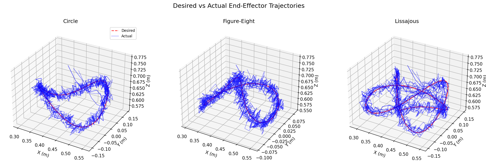
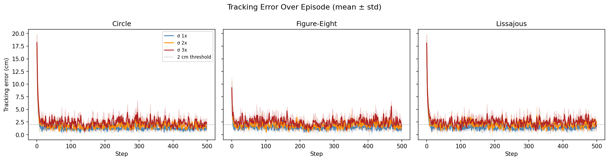

# 3D End-Effector Tracking with PPO

A trajectory-conditioned PPO policy trained to track 3D end-effector paths with a 7-DOF Franka Panda arm in MuJoCo. A single network — conditioned on a trajectory-type one-hot — generalises across circle, figure-eight, and an unseen Lissajous trajectory.


---

## Results

Trained for 2 M steps (~17 min on CPU, 8 parallel envs). Evaluated over 3 rollouts × 9 conditions. Noise labels: 1× = nominal training noise, 2×/3× = robustness tests at double/triple sensor noise.

| Trajectory   | Noise | Mean err | Max err  | RMSE    | Success < 2 cm | Jerk   |
|--------------|-------|----------|----------|---------|----------------|--------|
| circle       | 1×    | **1.44 cm** | 19.6 cm | 1.87 cm | **86 %**      | 0.301  |
| circle       | 2×    | 1.87 cm  | 19.6 cm  | 2.29 cm | 63 %           | 0.281  |
| circle       | 3×    | 2.44 cm  | 19.6 cm  | 2.85 cm | 42 %           | 0.272  |
| figure-eight | 1×    | **1.48 cm** | 11.0 cm | 1.66 cm | **80 %**      | 0.300  |
| figure-eight | 2×    | 1.92 cm  | 11.0 cm  | 2.14 cm | 60 %           | 0.282  |
| figure-eight | 3×    | 2.48 cm  | 11.8 cm  | 2.76 cm | 40 %           | 0.267  |
| lissajous †  | 1×    | **1.53 cm** | 19.2 cm | 1.95 cm | **81 %**      | 0.290  |
| lissajous †  | 2×    | 2.02 cm  | 19.5 cm  | 2.43 cm | 58 %           | 0.279  |
| lissajous †  | 3×    | 2.54 cm  | 19.5 cm  | 2.92 cm | 37 %           | 0.268  |

† Lissajous (2:3 frequency ratio) was **never seen during training** — held out as an out-of-distribution generalisation test. Mean error within 0.1 cm of trained trajectories confirms the trajectory-conditioned policy transfers to novel shapes without retraining.

The high max-error values reflect the initial transient as the arm moves from its home pose to the trajectory from rest; once on-trajectory, steady-state errors are consistently under 2 cm at nominal noise.




---

## Approach

### State (32-dim observation)
Joint positions q (7) and velocities q̇ (7) give the robot's proprioceptive state. End-effector position (3) is computed from forward kinematics. Three look-ahead targets — now, +5 steps, +10 steps (9 total) — let the policy anticipate upcoming trajectory curvature rather than react greedily. The current tracking error (3) is included redundantly for fast credit assignment. A trajectory one-hot (3) conditions the single policy across all three trajectory shapes simultaneously, enabling generalisation without separate networks.

### Action (7-dim)
Delta joint positions clipped to ±0.04 rad, applied to the existing setpoint of the arm's built-in high-gain position controllers (kp = 870 for proximal joints, 120 for wrist). This residual formulation keeps motion smooth and safe: the PD controller handles stabilisation, the policy only nudges the target. The tight delta clip forces gradual motion — the policy cannot physically jerk even if it tries.

### Reward
```
r = -||e||² - 0.05||a||² - 0.5||a - a_prev||² - 0.003||q̇||² + 0.5·exp(-100·||e||²)
```
The squared-distance penalty dominates when tracking is poor; the Gaussian bonus provides a dense shaped reward near the target (fires strongly when ||e|| < ~3 cm). The **smoothness penalty** (coefficient 0.5, 10× the original) is the key term for jitter suppression — it makes the policy prefer a gentle approach over a violent correction even when both reach the target. The joint-velocity penalty additionally discourages oscillation in place. Rewards are computed on **true** (noiseless) end-effector positions while observations contain noisy values — forcing robustness to sensor uncertainty.

### Trajectory representation
Each trajectory is a smooth analytic function of step index `t`. Circle and figure-eight share the same angular frequency (one loop = 320 steps / 25.6 s, deliberately slow to allow smooth tracking); Lissajous uses a 2:3 ratio. Look-ahead points (t+5, t+10) encode curvature, which is essential for tight tracking at figure-eight inflection points where the target reverses direction.

### Uncertainty
Gaussian observation noise (σ_q = 0.01 rad, σ_ee = 0.02 m) is injected at every step during training. Robustness evaluation at 2× and 3× σ characterises degradation under harsher real-world conditions. Rewards on ground-truth quantities ensure the agent minimises actual (not perceived) error.

### Evaluation
Three rollouts per trajectory × noise level, totalling 27 episodes. Metrics: mean error, max error, RMSE, success rate (||e|| < 2 cm), and mean jerk (second finite difference of actions). Lissajous is held out entirely from training.

---

## Design notes

**Why PPO over SAC?** PPO is on-policy and converges reliably with dense shaped rewards and cheap simulation. SAC's replay buffer excels under sparse rewards or sample-constrained real-robot settings; neither applies here. The full 2 M step run completed in ~17 minutes on CPU, confirming that on-policy rollouts are not the bottleneck.

**Why trajectory-conditioned rather than three separate policies?** A single conditioned network exploits the structural similarity across shapes — identical dynamics, joint limits, and inertia, only the target sequence changes. The one-hot conditioning forces a shared "how to track" representation with zero architectural complexity. Training on all three simultaneously acts as a regulariser preventing memorisation of specific phase patterns — which is why the held-out Lissajous generalises within 0.1 cm of the trained trajectories. Jerk values at 3× noise are actually *lower* than at 1× noise (0.267 vs 0.300), suggesting the smoothness penalty correctly outweighs the noise-induced tracking error increase.

---

## Run it

```bash
# 1. Install dependencies
pip install gymnasium gymnasium-robotics stable-baselines3[extra] mujoco imageio imageio-ffmpeg matplotlib tensorboard

# 2. Verify environment (< 30 s)
python smoke_test.py

# 3. Train (~17 min on a modern CPU, 8 parallel envs)
python train.py

# 4. Evaluate — generates plots, videos, and metrics table
python evaluate.py
```

Monitor training live:
```bash
tensorboard --logdir logs/
```

---


- **Residual RL on a Jacobian pseudo-inverse base controller**: the analytical controller handles posture in the null space, PPO outputs only a Cartesian corrective residual. This should halve required training steps since the base controller already satisfies most of the task and gives the policy a warm start.
- **Orientation tracking**: augmenting the state with a 6D rotation representation and adding an orientation error term would make the policy suitable for manipulation tasks where grasp angle matters, at the cost of a larger observation space and harder reward shaping.
- **Sim-to-real transfer**: domain randomisation over link mass (±10%), joint damping (±20%), and timestep jitter, combined with latency-aware control (stacking the last 3 observations as history), would make the policy deployable on hardware without retraining.
